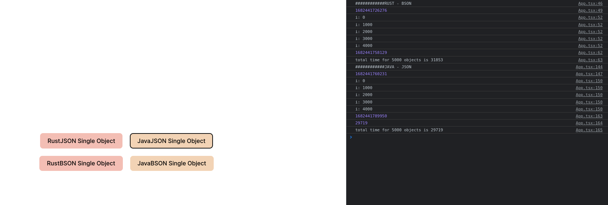
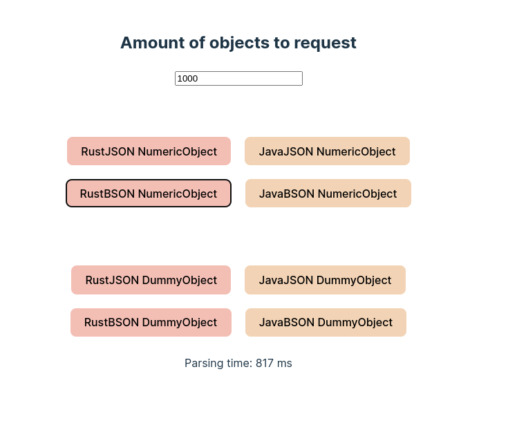
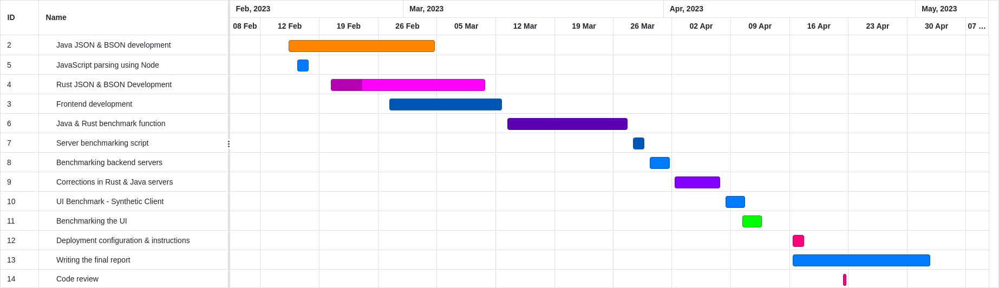

Communication Performance Comparison Between JSON and Binary Encoded Objects
============
This is my submission for the Individual Project in the 3rd year @ City, University of London.\
Author: [Adam Kaczmarski](https://github.com/AdamKaczmarski)


### Abstract
The research compares the deserialization performance of textual and
binary formats using different programming languages. The components
communicate with each other to obtain the data and measure their
deserialization times. Alongside the author mentions the drawbacks of
the most popular standard and looks for an alternative approach.\
The comparisons are conducted on two layers of a regular tech stack -
back-end and front-end. The backend contrasts two compiled languages -
Java and Rust. The frontend utilizes TypeScript.

<a name="#chapterlabel1"></a>
Introduction
============

Modern web applications rely on hundreds of services running on
thousands of servers. Every visit to a popular website triggers dozens
of requests. Based on the response, the site may behave differently for
each user e.g. suggest other products to buy [(1)](https://youtu.be/NzKcLB0_uAY). Popular
platforms share data to have the best recommendation for the user. For
example, Amazon could suggest products based on recent engagement with
sponsored posts on Instagram [(2)](https://xiphcyber.com/articles/social-media-tracking). The data passed between
services and users needs to follow common standards to make usage
easier. Furthermore, reading such a response has to have low latency.
High wait times to transfer the data could be a bottleneck in the
pipeline, eventually forcing the administrators to scale up the
production environment or make the developers improve, in the worst case
rewrite, their code [(3)](https://blog.cloudflare.com/how-we-built-pingora-the-proxy-that-connects-cloudflare-to-the-internet).\
The most popular format used on the web is JSON. Although it's easily
readable, JSON has its drawbacks. Parsing JSON payloads could be
resourceful (Explained in section [3.1](#json_spec)). Alongside text-like payloads, other data
formats are non-human readable. They have to be deserialized on the
clients' end. Those approaches are less popular but could be much faster
to obtain the data and take less (byte)space during the transfer
[(4)](https://youtu.be/MuCK81q1edU).\
A Binary JSON is an alternative to the textual format. It is utilized by
a Mongo Database to store data [(5)](https://www.mongodb.com/json-and-bson).\
Nowadays, communities talk about the need for quick and reliable
application [(6)](https://discord.com/blog/how-discord-stores-trillions-of-messages). By finding out the difference between data
exchange formats, it is possible to reduce the delivery time of pipeline
results to the user [(7)](https://www.geoffreylitt.com/resources/Postgres-BSON.pdf). In some cases, changing the format
could lead to a decrease in infrastructure costs. Some vendors offer
pricing by the amount of data transferred or CPU time usage
[(8)](https://cloud.google.com/functions/pricing)[(9)](https://aws.amazon.com/lambda/pricing).\
\
It is hypothesized that the usage of BSON instead of JSON improves the
performance in data exchange between applications. This experiment
compares the performance of JSON and BSON formats using different
programming languages - Rust, Java and TypeScript.\
Within this hypothesis, it is presumed that the binary format will
occupy less bytes reducing the size of the payloads.

<a name="Output summary"></a>
Output summary
==============

The chapter contains a description of every product of the project. It
is to help the end user understand the core functionality of each
component.

### [HOW TO RUN](./HOW_TO_RUN.md)

Rust Server
-----------

  Type                 Rust web server source code and executable binary
  -------------------- -------------------------------------------------------------------------------------------------------------------------------------------------------------------------------------------------------------------------------------------------------------------
  Description          The files contain the source of a fully functional Rust web server. The author has created eight rust files counting 433 lines together. Alongside the source code are compiled binaries (one for Windows, second's for Unix-like systems) that start the server.
  Purpose              Results reproduction and review of implementation methods
  Document reference   Implementation - [4.3.2](#rustImpl)
  Appendix reference   Source code and instruction appendix [12](#sourceCodeInstructions)

Java Server
-----------

  Type                 Java web server source code and executable jar file
  -------------------- --------------------------------------------------------------------------------------------------------------------------------------------------------------------------------------------------------------------------------------------------------------------------------------------------------------------------------------------------
  Description          This component includes Java files (407 lines) that combine the logic of the web server. It contains web configs, features and defined objects used for benchmarking purposes. There is also a compiled Java Archive that allows the user to run the web server. The Java archive can be launched on any system that supports Java installation.
  Purpose              Results reproduction and review of implementation methods
  Document reference   Implementation - [4.3.1](#javaImpl)
  Appendix reference   Source code and instruction appendix [12](#sourceCodeInstructions)

TypeScript Client
-----------------

  Type                 TypeScript files, bundled static files and Apache server configuration
  -------------------- -----------------------------------------------------------------------------------------------------------------------------------------------------------------------------------------------------------------------------------------------------------------------------------------------------------------------------------
  Description          TypeScript and CSS files that create a simple UI interface to trigger the API calls from servers. The UI's logic is coded in a single file. The rest of the files are the components that style the UI. In total, there are 348 lines. The Apache configuration is to enable proxy pass between the frontend and backend servers.
  Purpose              Results reproduction and review of implementation methods
  Document reference   Subchapter [4.4](#tsImpl)
  Appendix reference   Source code and instruction appendix [12](#sourceCodeInstructions)

Benchmarking scripts, graphs and logs
-------------------------------------

  Type                 Python, JavaScript files and benchmarks results
  -------------------- -----------------------------------------------------------------------------------------------------------------------------------------------------------------------------------------------------------------------------------------------------------------------------------------------------------------------------------------------------
  Description          Scripts to generate the graphs and CSV files. The server benchmark script gathers the parsing data from Java and Rust servers. Whereas the UI benchmarking script spawns a synthetic client that opens the browser, performs actions and gathers the parsing time from the paragraph. The materials include the obtained files and produced charts.
  Purpose              Automated benchmark reproduction and data gathering over larger scopes. Benchmark results overview.
  Document reference   Implementation discussed in subchapter [4.5](#benchmarkingMethodology).
  Appendix reference   Appendix [11](#benchmarkFiles)

Docker files
------------

  Type                 Text documents (Dockerfiles and docker-compose file)
  -------------------- ----------------------------------------------------------------------------------------------------------------------------------------------------------------------------------------------------------------------------
  Description          Text documents containing commands to build executables and Docker images. Those combined with the docker-compose file will spawn the containers required to run the tests. In total, there are 101 lines of instructions.
  Purpose              Application deployment for reporoduction
  Appendix reference   Appendix [12](#sourceCodeInstructions)

<a name="literature_review"></a>
Literature Review
=================

The chapter contains a review of relevant papers that help to understand
the domain problem. It was done to identify expectations of the research
and gain knowledge on how such experiments were conducted in the past.

<a name="json_spec"></a>
JSON Specification
------------------

JSON is a lightweight, text-based interchange format. It is one of the
most popular communication formats [(10)](https://www.oracle.com/database/what-is-json/#json-developers). JSON can represent
basic primitive types such as number, boolean, string, null and two
structures: arrays and objects. The data is stored in a key-value
format. We can access the value by using the named field/key [(11)](https://www.json.org/json-en.html).

When exchanging JSON data between systems, the text must be encoded
using UTF-8 [(12)](https://www.rfc-editor.org/info/rfc8259)

A UTF-8 string is made of a sequence of octets representing UCS
(Universal Character Set) characters [(21)](https://www.rfc-editor.org/info/rfc3629).\
*(1 octet = 1 byte = 8 bits)*\
A JSON payload containing object:

    { 
    "id":123, // 7 bytes  bytes
    "active":false, // 13 bytes 
    "name":"Adam", // 11 bytes 
    "balance": 123.23, // 15 bytes 
    "friendIDs": [324,234,434] // 21 bytes 
    }

will occupy 82 bytes. It can be confirmed when requesting such an object
from the server. The response contains a Content-Length header informing
about the byte size of the body.\


<a name="fig:json_curl"></a>


For a program to consume the JSON response, it must parse the whole
text, all bytes, before the object could be used in further execution.
[(12)](https://www.rfc-editor.org/info/rfc8259)

JSON is a schema-less data format [(22)](https://en.wikipedia.org/wiki/Data_exchange#Popular_languages_used_for_data_exchange). That means it
does not require any declaration of the included fields on communication
ends. The structure of a document has to comply with the determined set
of grammar rules [(11)](https://www.json.org/json-en.html). Today JSON has many usage scenarios such
as:

-   Configuration files,

-   Logging,

-   Intersystem communication,

-   Database storage.

BSON Specification
------------------

Binary JSON is a binary encoding format of JSON-like documents. The
implementation expands the data types of JSON. It allows specifying
exactly the byte length of fields [(13)](https://bsonspec.org).\
For example:\
A field of type int32 will only take 4 bytes in binary representation
and can store a number up to 2147483647. The same number encoded in JSON
would take 10 bytes of space. The same is for boolean values that occupy
only 1 bit in binary but take 4*(true)* or 5*(false)* bytes when encoded
in JSON [(12)](https://www.rfc-editor.org/info/rfc8259).\
As shown above, many BSON types are stored at a fixed length. It allows
parsers to skip bytes to obtain the searched field in the document.
[(13)](https://bsonspec.org)

The format is utilized in one of the most popular NoSQL databases -
[MongoDB](https://www.mongodb.com/) [(5)](https://www.mongodb.com/json-and-bson).

Space efficiency of JSON and binary encoded objects
---------------------------------------------------

The paper 'A benchmark of json-compatible binary serialization
specifications' (2022) investigates the byte occupancy of various data
formats. In most cases, it was found that BSON occupied more bytes than
JSON documents. The authors have classified their files into three
categories: textual, numeric, and boolean. They observed that the data
sets are dominated by string values. In some cases where numeric values
were the majority, BSON occupied less space. The paper also considers
compression algorithms which are not considered in this research.
[(14)](https://arxiv.org/abs/2201.03051)

Implementing BSON in PostgreSQL
-------------------------------

The authors of the paper 'Improving performance of schemaless document
storage in PostgreSQL using BSON' (2013) extended PostgreSQL's feature
to store JSON files by implementing BSON serialization. They focused on
the traversal aspect of those two formats. Commonly databases are
queried only to obtain a small number of values stored in the database.
The contributors have taken the BSON possibility of encoding the byte
length of some types and implemented that for PostgreSQL. BSON stores
strings in the same manner as its schema-less predecessor. Thus, there
is not much difference in the row size for textual values. The numeric
data helps the database reduce the size of its rows.

Although the storage difference might be unnoticed, it is the query
latency that the developers wanted to reduce. JSON data is stored in
plain text and has to be parsed fully to obtain data from queried keys.
When the same data is stored in binary representation, the authors noted
that their queries were up to five times faster. The possibility to skip
bytes helps the application find the data faster and reduces the disk's
utilization. [(7)](https://www.geoffreylitt.com/resources/Postgres-BSON.pdf)

XML vs JSON benchmark
---------------------

In the past, when JSON was pushing XML out of use, similar papers to the
current one have been made. The study 'Comparison of JSON and XML Data
Interchange Formats' (2009) contributed a lot to the core understanding
of this research's methodology. The authors measured response times and
tiresource utilization when sending/receiving large amounts of objects.
While doing so, the servers were monitored to compare the resource
utilization in the future. As XML is a mark-up format that requires a
sizable amount of text to be transmitted, JSON took the lead with its
schema-less approach. The result was that JSON communication was almost
300% faster in comparison to XML [(15)](https://citeseerx.ist.psu.edu/document?repid=rep1[@paulson]type=pdf[@paulson]doi=84321e662b24363e032d680901627aa1bfd6088f).

This project accommodates a similar approach as it is modelled to mirror
the applications' flow of consistently requesting data from other
services [(1)](https://youtu.be/NzKcLB0_uAY).

<a name="Methodology"></a>
Methodology
===========

<a name="introduction"></a>
Introduction
------------

The chapter describes the methods used to achieve the products of the
project. The author has decided to follow the agile approach. The
discovery of the domain problem required knowledge of serialization.
Thus, the code changes were tested continually. The number of features
was manageable to cover. The results had to be verified as sometimes
they led to code adjustments.

<a name="testDataMeth"></a>
Test Data
---------

It has been decided, in the experiment as the test data the applications
will transfer less complex generic values that can be found on modern
platforms.\
For example, each Twitter profile entry downloads a large JSON file.


<a name="fig:common_data_twitter"></a>
![Screenshot of Profile Data Request
[@twitter]](figures/common_data_twitter.png)

There are two types of objects. One called DummyObject that's fields are
mainly of type String and the second one, called NumericObject, consists
of number data (integers and doubles). Each of those schemas has a
sub-schema to add complexity to the data. For the textual object, it is
DummyFriend, and the numbers dominated one includes Coordinate. The
definitions are in appendix [9](#testDataSchemas). For ease of readiness, those schemas are
in TypeScript interface definitions. Each application had its
implementation of both models with respective data types.\
The test data was generated and coded into the application launch.
Therefore, the servers had equal data sets. Java's objects
initialization code can be found in appendix
[10](#testData).

Backend Implementation
----------------------

During the development of the front-end client, Cross-Origin Resource
Sharing (CORS) had to be disabled on both servers. The security measure
blocked access to the endpoints for local development and was enabled by
default. Disabling it allowed the applications from various ports to
access the resources. For example, localhost:5173 could not access the
endpoints of the Java server running on port 8080 due to CORS.

<a name="javaImpl"></a>
### Java server

At the beginning, the dependencies were added to the project. For JSON
serialization it was [Jackson](https://github.com/FasterXML/jackson),
for BSON, Mongo's implementation was used - [Java BSON
library](https://mvnrepository.com/artifact/org.mongodb/bson).
Initially, it was challenging to serialize the Plain Java Old Objects
(POJO) to a BSON Document. The library allowed the creation BSON
Document from a JSON string but did not allow the production of a
document using the object itself. Therefore it was essential to either
save the object into String format and then to binary or to find another
dependency that helped to omit those steps. Fortunately,
[bson4jackson](https://github.com/michel-kraemer/bson4jackson)
implements such functionality and enables BSON serialization in Jackson
methods. Spring Boot Starter Web provides the web functionality of the
application. It embeds Tomcat to handle requests and provides
easy-to-implement features such as Remote Procedure Call (RPC)
controller called RestController. The next step was to create a health
check endpoint. It returned an empty response from the server to
establish an initial connection. When its return status was eqaul to
200, the server was running.\
At first, all of the endpoints returned the DummyObject. Later on, the
endpoints were parameterized, documented in
[5.3](#endpointsDoc), so
the code would not have to be changed to test different structures.
During the lifecycle of the application
[Postman](https://www.postman.com/) and [curl](https://curl.se/) were
used to test the correctness of the endpoints.\
The JSON serialization was one of the first main tasks accomplished as
Jackon's ObjectMapper processed the entity into a string using a single
function. Although BSON's serialization was very timely to achieve, two
approaches have occurred. In the first one the object was encapsulated
into a JSON string, then to RawBsonDocument and finally encoded into a
byte array. This implementation had flaws as it required the application
to write the object into a JSON string. The method went against the
exepriment's objectives of not operating the text format. The second
approach of creating the binary response was to utilize bson4jackson.
The library reduced the complexity of the code and was easy to use.\
The last fragment of the application was to deserialize the objects in
both formats. To ease the automated testing triggerReqs endpoint was
created. As the name suggests, the interface was used to start the
action on the server. More about the testing in chapter
[4.5](#benchmarkingMethodology). The function required parameters,
explained further in chapter [5.3](#endpointsDoc), to run the test. A simple Data To Object
(DTO) helped to encapsulate those into a single data structure. At the
start of the function, the object holding the results had to be created.
The endpoint returned it in a JSON format, which helped a lot during the
automated testing.\
When the function was called, the server requested objects from the
specified provider and measured the parsing time of the data. The
deserialization time unit had to be microseconds as sometimes the
parsing time of fewer objects took less than one millisecond. The timer
started upon the response and stopped after the data was decapsulated,
given that the program had the structure already defined. For JSON,
again, Jackson was used to deserialize the string into the desired
object.\
There were two approaches to deserialize the BSON byte array. BSON
library could easily instantiate a RawBsonDocument but could not cast
the document into the desired object. It meant that the fields, of a
deserialized object, could not be accessed directly. This approach
worked much faster than its alternative. Bson4jackson's mapper provides
such method and access to the response's fields was possible. The
prototype's parsing times of those two approaches, when requesting ten
thousand DummyObjects from rust_server, are presented below.

    bson4jackson
    {
        "rust":1,
        "amount":10000,
        "bson_parsing_time_micro_s":432484,
        "bson_total_time_ms":1455
    }
    RawBsonDocument
    {
        "rust":1,
        "amount":10000,
        "bson_parsing_time_micro_s":28268,
        "bson_total_time_ms":1059
    }

Although Mongo's feature was around fifteen times faster, having the
desired object instantiated and its fields accessible was decided to be
more advantageous for the experiment.\
The same applies to the JSON format. JsonNode would share its API over
to the transferred String but direct access of object's properties would
be impossible.

<a name="rustImpl"></a>
### Rust server

The objective was to compare the parsing times using two distant
compiled languages with distinct memory management mechanisms. Rust's
ownership system has nothing in common with Java Virtual Machine's
garbage collection.\
The fundamental web server with a helath check endpoints was implemented
in reference to the book [*Zero To Production* (2022) by Luca
Palmieri](https://www.zero2prod.com/index.html). The text suggests one
of the most popular web frameworks called [actix](https://actix.rs/)
alongside the most popular asynchronous runtime -
[Tokio](https://tokio.rs/) to build a web application.\
In Rust, dependencies are referred to as crates [(16)](https://doc.rust-lang.org/book/ch01-03-hello-cargo.html). To
serialize and deserialize the structs (objects) serde, serde_json and
bson crates were used. The latter two are an addition to the mentioned
serde. The framework is a generic layer that allows other developers to
create parsing libraries on top of that [(17)](https://serde.rs/).\
Similar Java server's development, the first created endpoint returned a
JSON string. It serialized the struct into the textual format using only
one line of code. At the start, all the startup-initiated structs could
only use string slices due to the memory management of Rust. A string
slice is an immutable string value. It is an address to a specific point
of the binary. The Rust language is very efficient because it stores
static data on a stack whereas dynamic data, data that can change during
runtime, is stored on a heap. The string type is a vector of bytes. It
can change its size at any time. [(16)](https://doc.rust-lang.org/book/ch01-03-hello-cargo.html) Therefore, any string
variable has to be initiated after the program is compiled. The Tokio
runtime allows users to define dynamic global values in the code. The
objects are built by additional functions that return or initialize the
object [(18)](https://docs.rs/tokio/latest/tokio/index.html).
Contrary to Java's BSON solution, serde and bson can serialize any value
into RawDocumentBuffer. It can be saved as an array of bytes.\
The benchmarking function implementation is very similar to Java's one.
The required parameter is a JSON string with parameters that the
application uses in its tests.

After constructing BSON document from bytes, serde creates an object
based on the specified type. Therefore, after reading the octets, the
fields were accessible without an additional dependency. The story for
JSON is very similar. serde combined with serde_json deserialized the
payload into an accessible struct. A single function returns the object.
At first, tests on a smaller quantity of objects resulted in 0 ms of
parsing time. It was observed that Rust performed much faster and used
microseconds.

<a name="tsImpl"></a>
Frontend Client
---------------

The web application used ReactJS, one of the most popular JavaScript
frameworks [(19)](https://survey.stackoverflow.co/2022). TypeScript provides type safety and the
possibility to create subtyped structures. The language is a superset of
JavaScript. It provides static typing that helped the developers to
detect bugs during the implementation. The serialization is handled with
[MongoDB's BSON package](https://www.npmjs.com/package/bson).\
At first, the NodeJS script was written to deserialize a BSON response.
It was reasonably easy to do as the Node's environment supports buffers
that help to read the byte array from the body. Such buffer, was used to
create a byte array. The BSON library deserialized the vector into
documents. Unfortunately, the Buffer implementation limited to the
NodeJS environment. Therefore, it's not accessible in the browser.\
A proper environment has to be picked to develop a React application to
supply hot reload and quick build times. [ViteJS](https://vitejs.dev/)
provides runtime with a very low latency.\
The front-end goal of the application is to request data and parse them
into a specified structure. The objects are not shown in the UI nor
used. They are swept right after they move out of scope. The
[axios](https://axios-http.com/) package was introduced to handle the
asynchronous requests to the server. The drawback of the implementation
was lack of the byte array feature. Therefore, it could not be extracted
easily from the response body. JavaScript's fetch allows receiving the
payload as a blob (Binary Large Object) that includes an arrayBuffer
method. The buffer was used to create an UInt8 Array that the BSON
library used to deserialize into the defined, typed interface.
TypeScript's interface allows the developer to access the fields in the
structure.\
JavaScript Object Notation is a part of JS and TS. Therefore the
serialization methods are a part of fetch's interface.\
The first version of the UI had only buttons that, when clicked,
executed a function to get the objects. The parameters, such as the
number of objects, were hard-coded and adjusted inside the code. The
parsing time was measured using milliseconds and logged into the
browser's console.

<a name="fig:ui_first_view"></a>



Further into the project, to automate the benchmarking more buttons were
added, for each server, object type and the object's serialization
format. The parsing time was shown underneath the buttons, and input was
added to specify the number of objects our application had to request
and parse.

<a name="fig:ui_second_view"></a>



The UI has been styled using regular CSS. The simple interface provided
everything required to measure the parsing time of the test data.

<a name="benchmarkingMethodology"></a>
Benchmarking
------------

The chapter describes the benchmarking implementation and techniques
used to obtain the results. It also explains the components and how they
communicate with each other. The graph below (fig.
[4.4](#fig:diagram_with_providers)) presents the visual
relationship between them.

<a name="fig:diagram_with_providers"></a>


### Hardware Setup

The author decided not to operate on a personal machine to perform the
benchmarks. Individual systems have many services running based on user
behaviour. Those sometimes unexpectedly consume a lot of the available
CPU time or memory. Additionally, to not cause any slowdown, the machine
would have to be left running without any human interaction. The
decision was to use Virtual Machines (VM) provided by Google Cloud.
Those installations had no users interacting with them and could be left
running for nights without concerns whether the developer's machine was
on. The machines were accessible via ssh, and files were uploaded using
scp because the installation did not include any graphical user
interface. Screen command was used to execute the benchmarking scripts
without an active session to the server's terminal. It allowed the user
to detach from the current terminal session, leaving it running. The
user could reattach at any point in time.\
To carry out the benchmarks, two virtual machines were created. The
parameters are as follows:

1.  The backend server

    -   Hosted in zone europe-west-1.

    -   The GCP machine type: e2-standard-2.

    -   CPU: 2 Cores of Intel(R) Xeon(R) CPU @ 2.20GHz

    -   Available RAM: 8GB

    -   Running OS: Ubuntu 22.04.2 LTS (Jammy Jellyfish)

    -   Kernel Version: 5.15.0-1032-gcp

2.  The user server [\[userServer\]]{#userServer label="userServer"}

    -   Hosted in zone europe-southwest1-a

    -   The GCP machine type: e2-standard-2.

    -   CPU: 2 Cores of Intel(R) Xeon(R) CPU @ 2.20GHz

    -   Available RAM: 8GB

    -   Running OS: Ubuntu 22.04.2 LTS (Jammy Jellyfish)

    -   Kernel Version: 5.15.0-1032-gcp

Google Cloud Free trial credits have covered the payment for the
machines. To not obtain unnecessary additional costs, those VMs were
disabled after acquiring the results.

<a name="serverBenchmarking"></a>
### Server Benchmarking

To conduct the parsing benchmark between JSON and BSON formats, the
triggerReqs endpoints, mentioned in
[4.3.1](#javaImpl) and
[4.3.2](#rustImpl), were
utilized.\
Initially, the functions had hardcoded values instead of parameters and
logged the results instead of returning them. The user only needed to
call the endpoint with the number of objects to obtain. The requests
were triggered by a simple bash script. It used curl to start the
procedures on the servers. After the action, the author had to collect
the logs from the server and hand pick the results.\
Rust was performing two times slower than Java when one million objects
were to be parsed. The conclusion was that Java was serving the requests
at a much slower rate - the results of the tests are in appedix
[14](#RustJavaEarlyTests). There were a couple of factors:

-   JVM's garbage collection\
    The higher limit of the JVM's heap was not specified. That enforced
    more aggressive garbage collection on the environment. During the
    early tests, the serialization happened with each request. When
    those created objects added up, they had to be swept to release
    memory.\
    The solution was to set the max heap to 1024 megabytes. The GC
    pauses rate was much lower.

-   Slower serialization

-   Was Rust performing worse?

It was determined that the Rust build profile was a development one. A
proper parameter had to be provided to cargo, that is Rust's package
manager, to create an optimized binary. It improved the service time.
The next benchmark with
[ab](https://httpd.apache.org/docs/2.4/programs/ab.html), apache's
simple command line application to test HTTP servers, confirmed the
results. The test was conducted using one thread that sent one million
GET requests on /JSONObject and /BSONObject - the results are in
appendix [15](#RustJavaSecondTests).\
During the investigation, it was decided to take the requesting line of
code out of the measurement window, from between the start and stop of
the timer. The goal of the project was to measure the parsing time, and
the server's networking performance could be an obstacle adding
disruptions to the benchmark data.\
When requesting the objects to parse, it was decided to spawn two
servers that acted only as providers. Those were to return data to the
original applications. This way Java could also request from another
Java service and vice-versa. Two new services were only to check whether
the processing of GET requests impacted the parsing. For example, the
Java server, due to Spring's implementation, was returning four more
headers than the Rust server. Additionally, the Spring's implementation
included embedded Tomcat which acts as a HTTP web server.


<a name="fig:java_return_headers"></a>


<a name="fig:rust_return_headers"></a>


When the environment was ready to be benchmarked, the developer created
a Python script that sent POST requests to the servers. It gathered the
result data into a map and ran in rounds. Each round performed the same
action. Each key, number of objects, held its average parsing time. The
script had to have a specified amount of objects that the server should
request and parse. The loop incremented the number by five hundred until
a hundred thousand. When a request was serviced by the application. It
sent the specified amount of API calls to the provider server. For
example, when rust_server had received the URL of the java server
provider with the amount of four thousand. The rust_server would send
the same number of requests to the java server requesting the object.
Then, the sum of the parsing times was returned to the original
requester - the Python script. For each finished scenario, the script
created a CSV file with the map data and generated a graph to visualize
the results.\
There were sixteen scenarios in total.\
A one scenario was a combination of these elements:

-   Parsing server - rust-server, java-server;

-   Provider server - rust-server-provider, java-server-provider;

-   Object type - NumericObject, DummyObject;

-   Object format - JSON, BSON.

### UI Benchmarking

The automation to obtain the parsing results from the React application
was achieved using a synthetic client. The goal for the user was to open
the browser, trigger actions in the interface and obtain the demanded
results. Many frameworks enable such scripting possibilities, such as
[Selenium](https://www.selenium.dev/),
[Cypress](https://www.cypress.io/) and
[Playwright](https://playwright.dev/) but [Puppeteer](https://pptr.dev/)
was the best fit for such a simple scenario. Puppeteer is a Node.js
library that provides API to control the Google Chrome browser
[(20)](https://pptr.dev). The script was launched from the terminal using
NodeJS. It triggered the testing function for each hundred until it
reached the upper limit - default wass set to five thousand which
equalled fifty executions. The synthetic user's scenario was to open the
browser, input the number of objects to request, press the button and
wait until the parsing time results appeared on the screen. For the
execution to be successful, identification labels had to be added within
the application's code. The script would press the buttons or read the
values from components with the IDs assigned in the Document Object
Model (DOM). For the results to be more precise, the benchmark ran in
rounds. By default, each scenario, made for each server provider, object
type, object format, was triggered three times. An average of each test
result was calculated. At the end of the last round, the map was saved
to a CSV file to generate the graphs.\
During longer runs, when more objects were procssesed, Puppeteer would
timeout. Those default events had to be disabled.\
\
Based on the data from JavaScript's execution, the charts were generated
using Python. The script used [pandas](https://pandas.pydata.org/) to
read the data and [matplotlib](https://matplotlib.org/) to plot the
charts.\
\
The benchmarking of the front-end application was conducted on the *user
server*. The synthetic client accessed the *backend's server*
[Apache2](https://httpd.apache.org/), which served the static files and
acted as a proxy between the user and the Rust & Java applications.

Development timeline
--------------------

<a name="fig:Gantt chart"></a>



<a name="Results"></a>
Results
=======

The diagram below (fig.
[5.1](#fig:resultsCompDiagram)) presents the products of the
project and their relationships.


<a name="fig:resultsCompDiagram"></a>


<a name="javaResults"></a>
Backend Application - Java Server
---------------------------------

The fully working product is capable of serializing and deserializing
objects using BSON and JSON. The package contains a controller with
functions to execute via API. Spring's instrumentation made it possible
to route those procedures to the named endpoints using annotations. For
example,

        @GetMapping("/BSONObject/{objectType}")
        @GetMapping("/JSONObject/{objectType}")

Each route has to be accessed using the IP of the server, 127.0.0.1 when
launched locally followed by the bound port which by default is 8080
unless specified otherwise. The JSON serialization of the objects has
been achieved using the Jackson library. To convert objects to binary
representation, the author utilized bson4jackson. It added the required
functionality to the already-used dependency.\
To conduct the measurement of parsing the objects in various formats the
benchmarking function will request a single structure from the specified
location. It will repeat the action for the defined number and sum the
times. After the action is completed, it will return the results.
Additionally, the server included test object definitions and initiated
them with the data during the launch. A single encapsulation has
improved the server's latency and did not trigger aggressive garbage
collection.

<a name="rustResults"></a>
Backend Application - Rust Server
---------------------------------

The Rust application has the same functionalities as the Java server. By
default, the software binds to port 8081, which can be modified using
the launch parameter or alternatively the environment variable. The
actix framework provided web functionality. The tokio runtime added
asynchronous features to serve requests on separate threads. The
structs/objects definitions are in separate files for easier visibility.
Those are initialized with the test data (appendix
[10](#testData)) when
accessed for the first time through Tokio's OnceCell feature. Such
behaviour is due to Rust's memory management. It is explained in the
methodology chapter [4.3.2](#rustImpl).\
Serde framework handles the serialization of the structures. Additional
crates, serde_json and bson, enabled the desired format's
functionality. Due to the speed of compiled language, the parsing times
were measured using microseconds. In of most the test trials the
deserialization of a single object took less than a millisecond. It used
to gather false data where one could think that thousands of objects
were resolved without any latency.

<a name="endpointsDoc"></a>
Backend Servers - Endpoints specification
-----------------------------------------

The chapter contains the endpoints documentation of Java and Rust
servers. Two routes have different paths which is marked in the text.

-   RUST: `GET /health_check`\
    JAVA: `GET /healthCheck`\
    Returns the code 200 if the server is running. The response body is
    empty.

-   `GET /JSONObject/{objectType}`

    -   objectType Number specifying the type of requested object. The
        allowed values are 1 or 2 that represent NumericObject and
        DummyObject respectively.

    The endpoint returns a JSON string representing the object.

-   `GET /BSONObject/{objectType}`

    -   objectType Number specifying the type of requested object. The
        allowed values are 1 or 2 that represent NumericObject and
        DummyObject respectively.

    The endpoints returns the byte array representing BSON Document.

-   RUST: `GET /json_bytes`\
    JAVA: `GET /JSONbytes`\
    The endpoint return a simple JSON string. It was created only to
    showcase the amount of bytes consumed by a JSON response.

-   `POST /triggerReqs`\
    The endpoint requires a JSON payload of structure:

        {
            amount: number, //Amount of objects to request from provider_url
            provider_url: String, //The server to rquest objects from
            object_format: String, //The format of requested objects, allowed values are either "BSON" or "JSON"
            server_type: String, //The server type of provider_url
            object_type: String //The type of object to request, allowed values are either "DummyObject" or "NumericObject"
        }

    The endpoint return a JSON string containing the number of requests
    objects, total time of the action in miliseconds, the parsing time
    in microseconds and type of the provider server. Field \"java\":1
    will mean that the objects were requested from Java server).

Frontend Application - TypeScript Client
----------------------------------------

The web user interface objective was to request an object from one of
the servers and deserialize it into usable data. The TypeScript
interface feature allows the developer to add static types to a
structure. The application does not use the data. The goal was to
measure the time spent in the object deserialization process. BSON
package has provisioned the Binary JSON parsing features. The rest of
the functionalities are from core JavaScript. Regular CSS styled the
UI.\
The application has eight buttons that request the earlier specified
number of objects via input field. Those are requested from the server
that provides the front-end static files. After the objects are
received, the parsing time is displayed. ReactJS has added the
possibility to manage dynamic content.

Deployment
----------

The project's components can be deployed using two approaches.\
One is to run the binaries manually. Each server has its compiled file
that will launch the application. The front-end's static files have to
be served by a web server such as Apache HTTPD or
[nginx](https://www.nginx.com/) with proper proxy configuration to the
Java and Rust applications.\
The other approach used [Docker](https://www.docker.com/) to compile the
software and build images. Those packages will have the necessary
runtime dependencies and tools. They are used to create the containers.
Each of them executes everything it needs to run the application. By
using the defined docker-compose files the containers can request each
other utilizing the internal network. Each of the components is
accessible by the host on the exposed port. The documents simplify the
process required to deploy the project's stack.\
The instructions for both approaches are included in the code package.

<a name="benchmarking"></a>
Bechmarking
-----------

<a name="server-benchmarking"></a>
### Server Benchmarking

The Python script benchmarked both servers. It went through every
scenario three times and calculated an average of the parsing times
returned by the applications. There were sixteen scenarios for the
backend testing - mentioned in chapter
[4.5.2](#serverBenchmarking).\
The script was launched on the backend VM and the programs communicated
using an internal host network via HTTP. With each finished scenario the
graph was generated based on the gathered data. The outcome was saved to
a CSV file. Below are the graphs presenting the results of three rounds
of parsing up to one hundred thousand objects of each format from both
applications requesting different providers.

### DummyObject Deserialization Results

The grey line is to mark the lowest deserialization time using Rust, to
compare the results from different providers.


<a name="fig:dummyJson"></a>


<a name="fig:dummyBson ></a>


From the charts, the BSON format takes more time to deserialize by
around a second when using Java's implementation. On the other hand,
Rust's times are very close to each other - around two and a half
seconds when one hundred thousand objects are requested from Java and
around three seconds from another Rust instance. Noticeably, when the
objects were requested from Spring's web server, Rust performed much
better.

### NumericObject Deserialization Results

The grey line marks the lowest deserialization time using Rust to
compare the results from different providers.


<a name="fig:numericJson" ></a>


<a name="fig:numericBson" ></a>


The deserialization time of the structure dominated with numbers was
much lower using JSON for Java. Whereas, Rust has went equal using both
formats from both providers. Although when the requests were served by
the JVM representative, Rust handled those much faster.\
\
The Java implementation had much more latency in processing the binary
format of the structure. JSON parsing would be a much better choice to
transfer the data.\
The Rust approach has been even using both formats, the difference is
hard to spot. It can be noticed that when the objects were requested
from the Spring's web server, Rust performed much better. The
application's behaviour is very intriguing when using two different
providers.

### Space Occupancy of the test objects

As anticipated in chapter [3.3](#spaceViotti), the NumericObject has taken fewer bytes in its
binary form. Whereas the BSON DummyObject took more space than JSON. On
the figures below, the occupied octets are displayed in content-length
header.


<a name="fig:dummyJsonBytes"></a>


<a name="fig:dummyBsonBytes"></a>


<a name="fig:numericJsonBytes"></a>


<a name="fig:numericBsonBytes"></a>


### UI Benchmarking

The front-end application had only eight scenarios to cover. Each button
covered one of them. The synthetic client acted similarly to the Python
script. It ran three rounds of data gathering over the incremented
number of objects to parse. After the last round, the gathered results
were saved to CSV files. The outcome was visualized, using a Python
script, in two separate charts for each object type.


<a name="fig:uiBenchmarkResults"></a>


As pictured above, the JSON format has been two times faster than it's
binary alternative. The change in providers did not impact the
deserialization times. The NumericObject's processing was marginally
faster because it had fewer bytes.

<a name="conclusions"></a>
Conclusions and Discussion
==========================

Project Objectives
------------------

The project's goal was to examine if BSON improves the performance in
data exchage. Additionally, the author wanted to analyze the performance
using different programming languages on two layers of the tech stack.
The front end used TypeScript. For the back end, two different compiled
languages were examined against each other. The distinction was memory
management. Java uses garbage collection and Rust utilizes the ownership
system.\
The benchmarking chapter ([5.6](#benchmarking))
discussed that Java could not create objects
from BSON payloads with a better latency. While Rust had similar times
for both formats. Java's implementation was the only one that has not
used MongoDB's BSON dependency, as it was challenging to initiate
objects with it. The open source library has enabled such feature for
Jackson. Perhaps, the times would be much better if the library from
Mongo could initiate objects from the documents by itself. Such feature
exists when obtaining the documents using the Java driver to connect to
the Mongo database.\
The back-end test has shown that Rust is performing much better than
Java. The deserialization of the binary structures was around two times
faster. Rust's JSON parsing has been quicker in all cases exept figure
[5.2](#fig:dummyJson)
where the results were equal for both languages.\
\
As there are some possibilities to introduce Binary JSON to the compiled
environments, the TypeScript application did not manage the parsing very
well. For both object types, the textual deserialization was twice as
fast as its contender.\
The binary resolving required the developer to use a blob object to
obtain the byte array. The JavaScript/TypeScript front-end environments
did not seem well equipped to handle the binary payloads. It might be
better to convert the structures to a JSON format that does not require
pre-defined interfaces.\
\
The latency on slower platforms could be caused due to the way BSON
serializes the data. As mentioned earlier in the literature review
(chapter [3.3](#spaceViotti)), the NumericObject have occupied less space in
its binary form but the DummyObject was not that fortunate. The string
type in the structures is serialized the same way as in JSON.
Unfortunately, BSON does not support smaller integer formats such as
int8. The lowest integer type that BSON supports is int32. That's twenty
four more bits than some fields required. Perhaps the objects would take
even less space if smaller types were supported.\
The unexpected finding was that Rust handled the parsing time much
better when the data came from the Java server. It was envisioned that
the times would be equal or that the Rust response will be handled
quicker due to the fewer headers.

Future work
-----------

Due to the time constraints, there are still cases that require
investigation. Larger data sets could showcase the strength of BSON's
serialization, especially with more complex values. It would require
defining new structures in the code. With a larger scope, the use of
compression algorithms could be checked as they were not included in
this research - chapter [3.3](#spaceViotti).\
Additionally, the developer could measure the time the Java and
TypeScript applications have spent in garbage collection during the
parsing process. The created objects during the benchmarking had to be
removed from the memory to create new ones. That could be solved, by
enabling debugging logs, profiling the code during the benchmark or
using some integration that measures the hidden processes.\
It could be beneficial to check the libraries' executions of their
functions. The code profiler would help to understand the operations.
Perhaps object initialization is very costly in Java, where the faster
approach shares its interface with the data instead of putting it into
fields. Since MongoDB's BSON libraries are open source, the author could
create a ticket on a respective GitHub repository to open a discussion
on why it was not possible to instantiate an object using
RawBsonDocument. The conversation would be an opportunity to understand
more experienced developers and their decisions.\
Many other binary formats could be checked as a replacement for BSON.
Such as [Protocol Buffers](https://protobuf.dev/) or
[UBJSON](https://ubjson.org/) or custom serialization using libraries
like [Deku](https://docs.rs/deku/latest/deku/). Considering other
approaches would be beneficial to examine pros and cons of each.\
It would be valuable to compare the resource consumption of Rust and
Java servers. One could perform faster but consume much more CPU time or
memory. The results could help future developers in decision-making when
choosing a tech stack.\
\
From the benchmark results, there's a conclusion that Rust has handled
the responses from Java much faster than it did from the Rust provider
instance. The difference could be due to the embedded Tomcat in the
Spring framework.

Personal progress
-----------------

The author gained knowledge about the importance of serialization and
data transfer. Meaningful research showcased that the popular is not
always the best. Knowledge of other formats could be beneficial in
future projects or professional work.\
The biggest accomplishment was learning Rust's basics and other, more
advanced concepts. Rust's ownership system is very innovative, rendering
the software performant and reliable. The compiler helped to find bugs
throughout the project's progress. Given Rust's popularity gain, it is a
noteworthy addition to one's portfolio.\
The introduction of TypeScript has given an insight into the
vulnerability of JavaScript's environment. This examination furthered an
understanding of the utilization of the typing system in modern
front-end applications.\
The project was a great opportunity to utilize Python's flexibility in
creating quick scripts. The Matplotlib library has broadened the
author's toolkit to generate charts.\
Thanks to the experience gained in the Cloud Computing module, it was
easy to create Virtual Machines using the Google Cloud platform. The
machines required manual work to set up the services and an HTTP server.
It has contributed to the developer's knowledge of Linux systems and
cloud infrastructure.\
To make the deployment effortless, the author learned how to create
Docker files to build the components and instrument them using
docker-compose. It was a great contribution that will ease the
environment setup in future projects.\
Lastly, the author has expanded their ability to use the terminal. The
project was conducted on a Linux-based operating system.
[Neovim](https://neovim.io/) was used to write the report and code all
the components besides the Java server. The knowledge of key binds and
additional configuration has augmented the developer performance of
moving around projects. The list of applications and tools used can be
found in appendix [13](#toolsUsed).

Reuse Summary
=============

No code was reused to create the products of the project.

<a name="testDataSchemas"></a>
Test Data Schemas
=================

NumericObject

    interface NumericObject {
        id: String;
        index: number;
        numbr: number;
        coordinates: Coordinate[];
    }

Coordinate

    interface Coordinate {
        timestamp: number;
        latitude: number;
        longitude: number;
    }

DummyObject

    interface DummyObject {
        _id: String;
        index: number;
        guid: String;
        isActive: boolean;
        balance: number;
        picture: String;
        age: number;
        eyeColor: String;
        name: String;
        gender: String;
        company: String;
        email: String;
        phone: String;
        address: String;
        about: String;
        registered: String;
        latitude: number;
        longitude: number;
        tags: String[];
        friends: DummyFriend[];
        greeting: String;
        favoriteFruit: String;
    }

DummyFriend

    interface DummyFriend {
        id: number;
        name: String;
    }

<a name="testData"></a>
Test Data Object
================

DummyObject with an array of DummyFriend objects.

``` {.java language="Java"}
DummyObject dummyObject = new DummyObject(
    "63dcdee3a473b6e562063a35",
    0,
    "8c514ba0-f517-46ea-9dc3-dfd64c689bcf",
    false,
    2166.53,
    "http://placehold.it/32x32",
    29,
    "blue",
    "JosefaGrant",
    "female",
    "ZENTIA",
    "josefagrant@zentia.com",
    "+1(805)529-2872",
    "758HubbardStreet,
    Roderfield,
    Massachusetts,
    6249",
    "InsitvoluptatedolorLoremnostrudquisLoremauteet.Ametcillumnullacommodoullamcoidelitquiadipisicingfugiatreprehenderitconsequatut.Deseruntsitexcepteurutsuntmagnaesse.Culpanisiquiexcepteurinirureveniamculpatempor.Estipsumdeseruntlaboreesse.Proidentnoneasintincididunttemporeiusmodinnulladolore.\r\n",
    "2018-02-17T12:43:54-00:00",
    -62.176008,
    123.106292,
    new String[]{
        "minim",
        "Lorem",
        "ea",
        "incididunt",
        "voluptate",
        "laboris",
        "ex"
    },
    new DummyFriend[]{
        new DummyFriend(
            0,
            "KittyBrock"
        ),
        new DummyFriend(
            1,
            "MirandaMoody"
        ),
        new DummyFriend(
            2,
            "GeorgetteSherman"
        )
    },
    "Hello,
    JosefaGrant!Youhave10unreadmessages.",
    "apple"
);
```

NumericObject with an array of Coordinate objects.

        NumericObject numericObject = new NumericObject(
        "5ef42a23d-4a77-49c5-be8a-7ced8479f915",
        0,
        36,
        new Coordinate[]{
            new Coordinate(
                8828480041L,
                -71.228786,
                -97.911745
            ),
            new Coordinate(
                9299061322L,
                29.996248,
                -1.727763
            ),
            new Coordinate(
                9052787749L,
                -46.622638,
                141.685921
            ),
            new Coordinate(
                3491739584L,
                -59.283697,
                35.835898
            ),
            new Coordinate(
                1196235471L,
                -59.368215,
                -167.022009
            ),
            new Coordinate(
                7014816742L,
                -35.010705,
                -75.416994
            ),
            new Coordinate(
                3190810328L,
                22.557889,
                -108.35877
            ),
            new Coordinate(
                1756812663L,
                -12.775935,
                66.956942
            ),
            new Coordinate(
                9237021137L,
                60.138851,
                -27.953068
            ),
            new Coordinate(
                8377575119L,
                70.411835,
                25.353941
            )
    });

<a name="benchmarkFiles"></a>
Benchmark results
=================

The server and UI benchmark CSV files and graphs are submitted as an
addtional material. The ZIP file is named benchmark-results.zip\

<a name="toolsUsed"></a>
Tools and applications used
===========================

-   OS: Pop!_OS 22.04

-   Neovim (For everything else)

-   IntelliJ IDEA (For Java development)

-   curl

-   ssh

-   scp

-   Postman

-   Google Chrome (benchmarking)

-   LaTeX to write the report

<a name="RustJavaEarlyTests"></a>
Rust and Java prototype performance tests
=========================================

The test was conducted on 14th of March.

    ########## -- JAVA JSON
    Time taken for tests:   152.102 seconds
    Requests per second:    6574.54 [#/sec] (mean)
    Transfer rate:          6369.08 [Kbytes/sec] received
    ########## -- JAVA BSON
    Time taken for tests:   152.666 seconds
    Requests per second:    6550.23 [#/sec] (mean)
    Transfer rate:          6108.86 [Kbytes/sec] received
    ########## -- RUST JSON
    Time taken for tests:   316.532 seconds
    Requests per second:    3159.24 [#/sec] (mean)
    Transfer rate:          2967.96 [Kbytes/sec] received
    ########## -- RUST BSON
    Time taken for tests:   319.982 seconds
    Requests per second:    3125.17 [#/sec] (mean)
    Transfer rate:          2823.03 [Kbytes/sec] received

<a name="RustJavaSecondTests"></a>
Rust and Java prototype performance test - release build
========================================================

The test was conducted on 15th of March.

    ########## -- JAVA JSON
    Time taken for tests:   129.011 seconds
    Requests per second:    7751.26 [#/sec] (mean)
    Transfer rate:          7509.04 [Kbytes/sec] received
    ########## -- JAVA BSON
    Time taken for tests:   151.742 seconds
    Requests per second:    6590.14 [#/sec] (mean)
    Transfer rate:          6146.08 [Kbytes/sec] received
    ########## -- RUST JSON
    Time taken for tests:   107.848 seconds
    Requests per second:    9272.29 [#/sec] (mean)
    Transfer rate:          8710.88 [Kbytes/sec] received
    ########## -- RUST BSON
    Time taken for tests:   107.921 seconds
    Requests per second:    9266.06 [#/sec] (mean)
    Transfer rate:          8370.22 [Kbytes/sec] received
